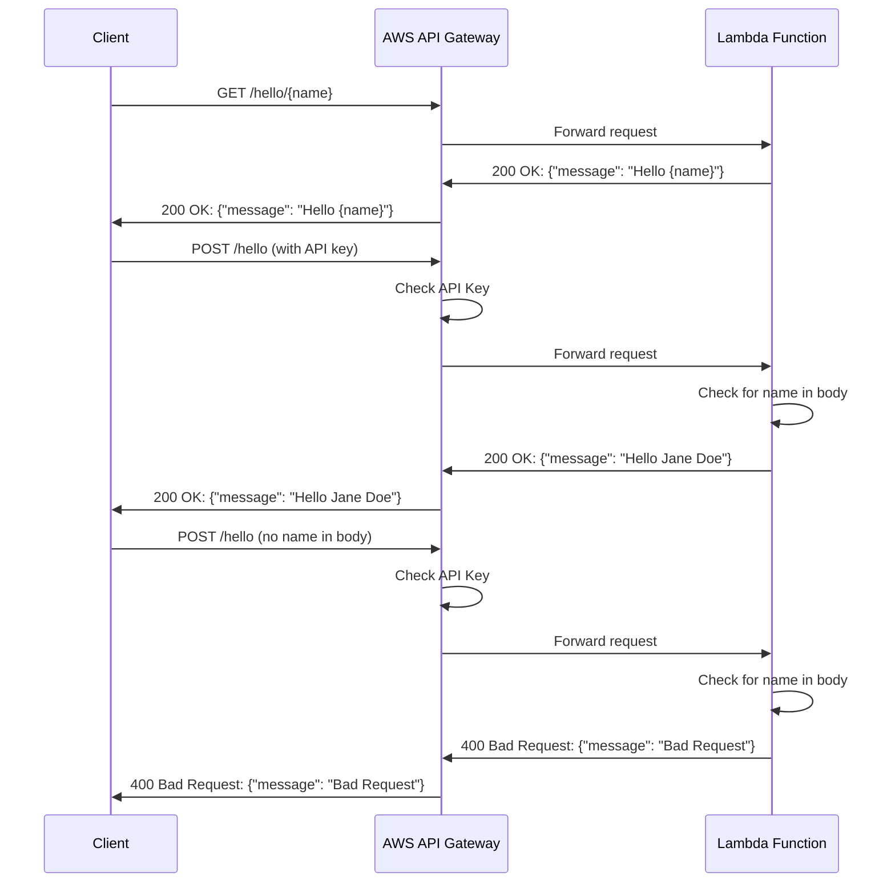

# Simple Hello API

This project implements a simple API using AWS CDK, API Gateway, and Lambda functions based on the provided OpenAPI schema.

The `cdk.json` file tells the CDK Toolkit how to execute your app.

## How to use

1. Ensure you have node.js installed. I recommend >19.0.0, haven't tested earlier versions.
2. `npm install`
3. `aws configure`(Because deployment uses aws account from CLI config to deploy)
4. `cdk bootstrap`
5. `cdk deploy`
   Your api gateway should now be deployed with the lambda functions integrated 🥳

### Clean up

When you're done, clean up by running `cdk destroy HelloerStack` to destroy the cloudformation stack and all associated resources. 🧹

## Useful commands

- `npm run build` compile typescript to js. (AWS cli builds for us, this is not necessary for deploying the cdk stack. See dist/README.md for info)
- `npm run watch` watch for changes and compile
- `npm run test` perform the vitest unit tests
- `npx cdk deploy` deploy this stack to your default AWS account/region
- `npx cdk diff` compare deployed stack with current state
- `npx cdk synth` emits the synthesized CloudFormation template

## Sequence diagram

Also found from project root

